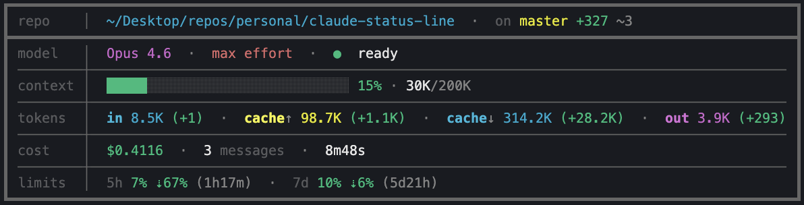

<div align="center">

# claude-status-line

**A rich, color-coded custom status line for [Claude Code](https://claude.ai/code) showing context usage, git state, costs, rate limits, and more**

[](#macos)
[](#windows)
[](#macos)
[](#windows)
[](#license)

---

Replaces Claude Code's default status bar with a detailed, color-coded dashboard
showing context usage, git state, costs, rate limits, and more — all inside a clean box frame.



</div>

### Preview

```
┏━━━━━━━━━━━━━━━━━━━━━━━━━━━━━━━━━━━━━━━━━━━━━━━━━━━━━━━━━━━━━━━━━━━━━━━━━━━━━━━━━━━━━┓
┃ repo    │  ~/projects/my-app  ·  on main +12 -3 ~1                                  ┃
┣━━━━━━━━━━━━━━━━━━━━━━━━━━━━━━━━━━━━━━━━━━━━━━━━━━━━━━━━━━━━━━━━━━━━━━━━━━━━━━━━━━━━━┫
┃ model   │  Opus 4.7  ·  high effort  ·  ● ready                                     ┃
┃ ────────┼───────────────────────────────────────────────────────────────────────────┃
┃ context │  ██████████░░░░░░░░░░░░░░░░░░░░ 35% · 350K/1M                             ┃
┃ ────────┼───────────────────────────────────────────────────────────────────────────┃
┃ tokens  │  in 1.2K (+0)  ·  cache↑ 0 (+0)  ·  cache↓ 8.5K (+800)  ·  out 3.4K (+0)  ┃
┃ ────────┼───────────────────────────────────────────────────────────────────────────┃
┃ cost    │  $0.1234  ·  5 messages  ·  2m05s                                         ┃
┃ ────────┼───────────────────────────────────────────────────────────────────────────┃
┃ limits  │  5h 12% ⇣5% (3h)  ·  7d 4%                                                ┃
┗━━━━━━━━━━━━━━━━━━━━━━━━━━━━━━━━━━━━━━━━━━━━━━━━━━━━━━━━━━━━━━━━━━━━━━━━━━━━━━━━━━━━━┛
```

---

## Features

| Row | What it shows |
|-----|---------------|
| **repo** | Working directory (shortened relative to `$HOME`) and git branch with `+insertions` / `-deletions` / `~untracked` — cached by file mtime for speed |
| **agent** | Agent name with compact context % and in/out tokens (when running with `--agent` flag) |
| **model** | Active model (e.g. `Opus 4.7`), reasoning effort level, and ready/working indicator with live output token counter |
| **context** | Color-coded progress bar with percentage and token count (green < 60%, yellow < 85%, red 85%+) |
| **tokens** | Cumulative session breakdown — `in` (fresh input), `cache↑` (cache writes), `cache↓` (cache reads), `out` (output) |
| **cost** | Session cost in USD, message count, and wall-clock duration |
| **limits** | 5-hour and 7-day rate limit usage with burn-rate arrows (`⇡` over pace / `⇣` under pace) and time until reset |

All rows are dynamic — empty rows are automatically hidden.

---

## Highlights

### Context awareness at a glance
The context bar changes color as your conversation grows — **green** when you have plenty of room, **yellow** as you approach 85%, and **red** when you're close to the limit. No more surprise context resets mid-task.

### Burn-rate arrows on rate limits
The limits row doesn't just show usage — it shows **pace**. An `⇡` arrow means you're burning tokens faster than the reset rate (slow down), while `⇣` means you're under pace with time until reset. Plan your session around real data instead of guessing.

### Live working indicator
The model row shows a real-time status — `● ready` when idle, or `○ working` with a live output token counter while Claude is generating. You always know if the model is still thinking or waiting for you.

### Smart git caching
Git status is cached per-session using file modification times on `.git/HEAD`, `.git/index`, and the working directory. The status line stays fast even in massive repos — no `git status` on every refresh.

### Compact agent view
When running with `--agent`, the agent row shows context usage as a percentage and cumulative in/out tokens in a compact inline format — all the essentials without taking up extra rows.

---

## Quick Install

> **Note:** The installer will ask before overwriting any existing `statusLine` configuration.

### macOS

```bash
curl -fsSL https://raw.githubusercontent.com/axlaser/claude-status-line/master/macos/install.sh | bash
```

The installer checks for `jq` and offers to install it via Homebrew if missing.

### Windows

```powershell
irm https://raw.githubusercontent.com/axlaser/claude-status-line/master/windows/install.ps1 | iex
```

No additional dependencies required — uses built-in PowerShell.

### From a cloned repo

```bash
git clone https://github.com/axlaser/claude-status-line.git
cd claude-status-line
bash macos/install.sh      # macOS
.\windows\install.ps1      # Windows
```

---

## Manual Install

### macOS

1. **Install jq** (if you don't have it):
   ```bash
   brew install jq
   ```

2. **Download the script** to your Claude config directory:
   ```bash
   mkdir -p ~/.claude
   curl -fsSL https://raw.githubusercontent.com/axlaser/claude-status-line/master/macos/statusline.sh -o ~/.claude/statusline.sh
   chmod +x ~/.claude/statusline.sh
   ```

3. **Add to your Claude Code settings** — edit `~/.claude/settings.json`:
   ```json
   {
     "statusLine": {
       "type": "command",
       "command": "~/.claude/statusline.sh",
       "refreshInterval": 2
     }
   }
   ```

4. **Restart Claude Code** — the status line appears at the bottom of your terminal.

### Windows

1. **Download the script** to your Claude config directory:
   ```powershell
   Invoke-WebRequest -Uri "https://raw.githubusercontent.com/axlaser/claude-status-line/master/windows/statusline.ps1" -OutFile "$env:USERPROFILE\.claude\statusline.ps1"
   ```

2. **Add to your Claude Code settings** — edit `%USERPROFILE%\.claude\settings.json`:
   ```json
   {
     "statusLine": {
       "type": "command",
       "command": "powershell -NoProfile -File C:/Users/YOUR_USERNAME/.claude/statusline.ps1",
       "refreshInterval": 2
     }
   }
   ```
   Replace `YOUR_USERNAME` with your Windows username.

3. **Restart Claude Code** — the status line appears at the bottom of your terminal.

---

## Updating

Re-run the install command. Your other settings are preserved.

### macOS

```bash
curl -fsSL https://raw.githubusercontent.com/axlaser/claude-status-line/master/macos/install.sh | bash
```

### Windows

```powershell
irm https://raw.githubusercontent.com/axlaser/claude-status-line/master/windows/install.ps1 | iex
```

### From a cloned repo

```bash
cd claude-status-line
git pull
bash macos/install.sh      # macOS
.\windows\install.ps1      # Windows
```

Restart Claude Code to pick up the new version.

---

## Uninstalling

Removes the script and the `statusLine` config from `settings.json`. Your other settings are preserved.

### macOS

```bash
curl -fsSL https://raw.githubusercontent.com/axlaser/claude-status-line/master/macos/uninstall.sh | bash
```

### Windows

```powershell
irm https://raw.githubusercontent.com/axlaser/claude-status-line/master/windows/uninstall.ps1 | iex
```

### From a cloned repo

```bash
bash macos/uninstall.sh      # macOS
.\windows\uninstall.ps1      # Windows
```

Restart Claude Code to return to the default status bar.

---

## Customization

### Refresh Interval

By default the status line updates after each assistant message. To also refresh on a timer (useful for keeping the clock and git status current), add `refreshInterval` to your settings:

```json
{
  "statusLine": {
    "type": "command",
    "command": "~/.claude/statusline.sh",
    "refreshInterval": 2
  }
}
```

This refreshes every 2 seconds (minimum 1).

### Padding

Add horizontal spacing around the status line:

```json
{
  "statusLine": {
    "type": "command",
    "command": "~/.claude/statusline.sh",
    "padding": 2
  }
}
```

### Debug Logging

Both scripts write debug logs to help troubleshoot issues:

| Platform | Log location |
|----------|-------------|
| macOS | `~/.claude/statusline-debug.log` |
| Windows | `%USERPROFILE%\.claude\statusline-debug.log` |

---

## Troubleshooting

<details>
<summary><strong>Status line not appearing</strong></summary>

- Verify the script path in `settings.json` is correct
- macOS: confirm the script is executable (`chmod +x ~/.claude/statusline.sh`)
- Restart Claude Code after changing settings
- Check the debug log for errors

</details>

<details>
<summary><strong>jq: command not found (macOS)</strong></summary>

Install jq via Homebrew:
```bash
brew install jq
```
If you don't have Homebrew, install it from [brew.sh](https://brew.sh) or install jq from [jqlang.github.io/jq](https://jqlang.github.io/jq/download/).

</details>

<details>
<summary><strong>Context percentage shows 0% on first message</strong></summary>

This is normal. Claude Code doesn't report context usage until after the first API response. The bar will populate on the second refresh.

</details>

<details>
<summary><strong>Rate limits row not showing</strong></summary>

Rate limit data is only available for Claude.ai Pro and Max subscribers. API users (Anthropic Console) won't see this row. The data also only appears after the first API response in a session.

</details>

<details>
<summary><strong>Git status showing stale data</strong></summary>

Git state is cached per-session using file modification times. If the cache seems stuck:
- The cache auto-invalidates when `.git/HEAD`, `.git/index`, or the working directory mtime changes
- Manually clear: delete `statusline-git-<session_id>.txt` from your temp directory (`$TMPDIR` on macOS, `%TEMP%` on Windows)

</details>

<details>
<summary><strong>Script errors in the debug log</strong></summary>

Check `~/.claude/statusline-debug.log` for `READ/PARSE FAILED` or `UNHANDLED` entries. Common causes:
- Claude Code passed unexpected JSON (check `stdin head:` in the log)
- Permission issues writing cache files to the temp directory

</details>

---

## How It Works

Claude Code pipes a JSON object to the script's stdin on each update. The JSON contains session data — model info, context window usage, cost, rate limits, transcript path, and more. The script parses this data, optionally reads the conversation transcript for additional metrics (message count, token breakdown, idle/working state), and outputs ANSI-colored text that Claude Code renders as the status bar.

Both scripts implement aggressive caching (git state by file mtime, transcript data by transcript mtime) to keep refresh times fast even in large repositories.

---

## License

MIT License. See [LICENSE](LICENSE) for details.
