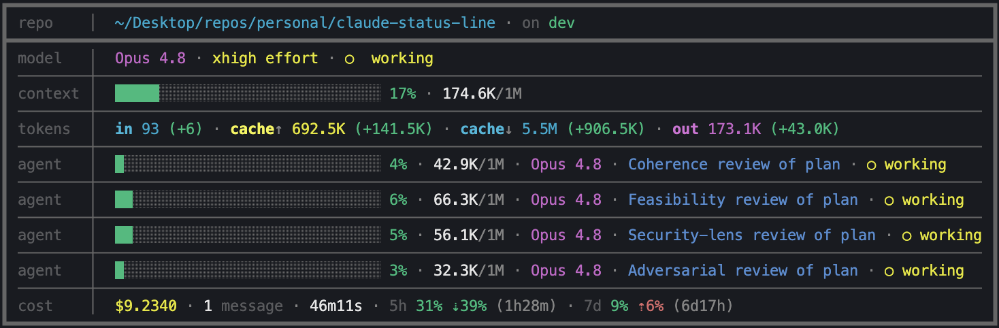

<div align="center">

# claude-status-line

**A rich, color-coded custom status line for [Claude Code](https://claude.ai/code) showing context usage, git state, costs, rate limits, and more**

[](#macos)
[](#linux)
[](#windows)
[](#macos)
[](#windows)
[](#license)

---

Replaces Claude Code's default status bar with a detailed, color-coded dashboard
showing context usage, git state, costs, rate limits, and more — all inside a clean box frame.



</div>

## Features

| Row | What it shows |
|-----|---------------|
| **repo** | Working directory (shortened relative to `$HOME`) and git branch with `↑ahead` / `↓behind` remote tracking, `+insertions` / `-deletions` / `~untracked`, and `⊟stash` count |
| **agent** | Agent name with compact context % and in/out tokens (when running with `--agent` flag) |
| **model** | Active model (e.g. `Opus 4.7`), reasoning effort level, and ready/working indicator with live output token counter |
| **context** | Color-coded progress bar with percentage and token count (green < 60%, yellow < 85%, red 85%+) |
| **tokens** | Cumulative session breakdown — `in` (fresh input), `cache↑` (cache writes), `cache↓` (cache reads), `out` (output) |
| **cost** | Session cost in USD, message count, and wall-clock duration |
| **limits** | 5-hour and 7-day rate limit usage with burn-rate arrows (`⇡` over pace / `⇣` under pace) and time until reset |
| **notifications** | Sound alerts and native OS toast popups for permission requests, task completion, context compaction, rate limit warnings, and context window warnings (enable during install) |

All rows are dynamic — empty rows are automatically hidden.

---

## Highlights

### Context awareness at a glance
The context bar changes color as your conversation grows — **green** when you have plenty of room, **yellow** as you approach 85%, and **red** when you're close to the limit. No more surprise context resets mid-task.

### Burn-rate arrows on rate limits
The limits row doesn't just show usage — it shows **pace**. An `⇡` arrow means you're burning tokens faster than the reset rate (slow down), while `⇣` means you're under pace with time until reset. Plan your session around real data instead of guessing.

### Live working indicator
The model row shows a real-time status — `● ready` when idle, or `○ working` with a live output token counter while Claude is generating. You always know if the model is still thinking or waiting for you.

### Compact agent view
When running with `--agent`, the agent row shows context usage as a percentage and cumulative in/out tokens in a compact inline format — all the essentials without taking up extra rows.

---

## Quick Install

> **Note:** The installer will ask before overwriting any existing `statusLine` configuration.

### macOS

```bash
curl -fsSL https://raw.githubusercontent.com/axlaser/claude-status-line/master/macos/install.sh | bash
```

The installer checks for `jq` and offers to install it via Homebrew if missing.

### Linux

```bash
curl -fsSL https://raw.githubusercontent.com/axlaser/claude-status-line/master/linux/install.sh | bash
```

The installer detects your package manager (apt, dnf, pacman, zypper, apk) and offers to install `jq` if missing.

### Windows

```powershell
irm https://raw.githubusercontent.com/axlaser/claude-status-line/master/windows/install.ps1 | iex
```

No additional dependencies required — uses built-in PowerShell.

### From a cloned repo

```bash
git clone https://github.com/axlaser/claude-status-line.git
cd claude-status-line
bash macos/install.sh      # macOS
bash linux/install.sh      # Linux
.\windows\install.ps1      # Windows
```

---

## Manual Install

### macOS

1. **Install jq** (if you don't have it):
   ```bash
   brew install jq
   ```

2. **Download the script** to your Claude config directory:
   ```bash
   mkdir -p ~/.claude
   curl -fsSL https://raw.githubusercontent.com/axlaser/claude-status-line/master/macos/statusline.sh -o ~/.claude/statusline.sh
   chmod +x ~/.claude/statusline.sh
   ```

3. **Add to your Claude Code settings** — edit `~/.claude/settings.json`:
   ```json
   {
     "statusLine": {
       "type": "command",
       "command": "~/.claude/statusline.sh",
       "refreshInterval": 1
     }
   }
   ```

4. **Restart Claude Code** — the status line appears at the bottom of your terminal.

### Linux

1. **Install jq** (if you don't have it):
   ```bash
   sudo apt install jq        # Debian/Ubuntu
   sudo dnf install jq        # Fedora/RHEL
   sudo pacman -S jq          # Arch
   ```

2. **Download the script** to your Claude config directory:
   ```bash
   mkdir -p ~/.claude
   curl -fsSL https://raw.githubusercontent.com/axlaser/claude-status-line/master/linux/statusline.sh -o ~/.claude/statusline.sh
   chmod +x ~/.claude/statusline.sh
   ```

3. **Add to your Claude Code settings** — edit `~/.claude/settings.json`:
   ```json
   {
     "statusLine": {
       "type": "command",
       "command": "~/.claude/statusline.sh",
       "refreshInterval": 1
     }
   }
   ```

4. **Restart Claude Code** — the status line appears at the bottom of your terminal.

### Windows

1. **Download the script** to your Claude config directory:
   ```powershell
   Invoke-WebRequest -Uri "https://raw.githubusercontent.com/axlaser/claude-status-line/master/windows/statusline.ps1" -OutFile "$env:USERPROFILE\.claude\statusline.ps1"
   ```

2. **Add to your Claude Code settings** — edit `%USERPROFILE%\.claude\settings.json`:
   ```json
   {
     "statusLine": {
       "type": "command",
       "command": "powershell -NoProfile -File C:/Users/YOUR_USERNAME/.claude/statusline.ps1",
       "refreshInterval": 1
     }
   }
   ```
   Replace `YOUR_USERNAME` with your Windows username.

3. **Restart Claude Code** — the status line appears at the bottom of your terminal.

---

## Updating

Re-run the install command. Your other settings are preserved.

### macOS

```bash
curl -fsSL https://raw.githubusercontent.com/axlaser/claude-status-line/master/macos/install.sh | bash
```

### Linux

```bash
curl -fsSL https://raw.githubusercontent.com/axlaser/claude-status-line/master/linux/install.sh | bash
```

### Windows

```powershell
irm https://raw.githubusercontent.com/axlaser/claude-status-line/master/windows/install.ps1 | iex
```

### From a cloned repo

```bash
cd claude-status-line
git pull
bash macos/install.sh      # macOS
bash linux/install.sh      # Linux
.\windows\install.ps1      # Windows
```

Restart Claude Code to pick up the new version.

---

## Uninstalling

Removes the script and the `statusLine` config from `settings.json`. Your other settings are preserved.

### macOS

```bash
curl -fsSL https://raw.githubusercontent.com/axlaser/claude-status-line/master/macos/uninstall.sh | bash
```

### Linux

```bash
curl -fsSL https://raw.githubusercontent.com/axlaser/claude-status-line/master/linux/uninstall.sh | bash
```

### Windows

```powershell
irm https://raw.githubusercontent.com/axlaser/claude-status-line/master/windows/uninstall.ps1 | iex
```

### From a cloned repo

```bash
bash macos/uninstall.sh      # macOS
bash linux/uninstall.sh      # Linux
.\windows\uninstall.ps1      # Windows
```

Restart Claude Code to return to the default status bar.

---

## Customization

### Refresh Interval

By default the status line updates after each assistant message. To also refresh on a timer (useful for keeping the clock and git status current), add `refreshInterval` to your settings:

```json
{
  "statusLine": {
    "type": "command",
    "command": "~/.claude/statusline.sh",
    "refreshInterval": 1
  }
}
```

This refreshes every 1 second (minimum 1).

### Padding

Add horizontal spacing around the status line:

```json
{
  "statusLine": {
    "type": "command",
    "command": "~/.claude/statusline.sh",
    "padding": 2
  }
}
```

### Debug Logging

Both scripts write debug logs to help troubleshoot issues:

| Platform | Log location |
|----------|-------------|
| macOS / Linux | `~/.claude/statusline-debug.log` |
| Windows | `%USERPROFILE%\.claude\statusline-debug.log` |

### Notifications

The installer can configure both **sound** and **visual** (native OS toast) notifications. Each channel is independently toggleable per event type.

#### Events

| Event | Trigger |
|-------|---------|
| Permission request | Claude shows a permission dialog |
| Task complete | Claude finishes responding |
| Compaction start | Context compaction begins |
| Compaction done | Context compaction completes |
| Context high | Context window usage >= 70% (configurable) |
| Rate limit | Rate limit usage >= 80% (configurable) |

#### Sound

Platform-native sounds — no additional software needed:

| Platform | Permission / Compaction start | Complete / Compaction done | Warning (rate limit / context) | Player |
|----------|-------------------------------|----------------------------|-------------------------------|--------|
| macOS | Tink | Glass | Sosumi | `afplay` |
| Linux | freedesktop bell | freedesktop complete | freedesktop dialog-warning | `paplay` / `aplay` |
| Windows | System Exclamation | System Asterisk | System Hand | Built-in (`SystemSounds`) |

#### Visual (toast notifications)

| Platform | Tool | Install |
|----------|------|---------|
| macOS | [terminal-notifier](https://github.com/julienXX/terminal-notifier) | `brew install terminal-notifier` |
| Linux | notify-send | `sudo apt install libnotify-bin` (or equivalent for your distro) |
| Windows | [BurntToast](https://github.com/Windos/BurntToast) | `Install-Module -Name BurntToast -Scope CurrentUser` |

The installer offers to install these automatically. If the visual tool is missing, sound notifications still work — visual silently degrades.

Toast notifications display the Claude icon ([source](https://commons.wikimedia.org/wiki/File:Claude_AI_symbol.svg), public domain). The installer copies it to `~/.claude/claude-icon.png` automatically.

#### Configuration

Notification settings are stored in `~/.claude/notify-config.json`:

```json
{
  "permission":        { "sound": true, "visual": true },
  "stop":              { "sound": true, "visual": true },
  "rate_limit":        { "sound": true, "visual": true, "threshold": 80 },
  "context_high":      { "sound": false, "visual": true, "threshold": 70 },
  "compaction_start":  { "sound": true, "visual": true },
  "compaction_done":   { "sound": true, "visual": true }
}
```

Edit this file directly to toggle individual channels or adjust thresholds. The installer creates it with defaults on first run.

To enable after initial install, re-run the installer and answer **y** to the notification prompts. To disable, run the uninstaller — it removes notification hooks while preserving your other settings.

---

## Troubleshooting

<details>
<summary><strong>Status line not appearing</strong></summary>

- Verify the script path in `settings.json` is correct
- macOS/Linux: confirm the script is executable (`chmod +x ~/.claude/statusline.sh`)
- Restart Claude Code after changing settings
- Check the debug log for errors

</details>

<details>
<summary><strong>jq: command not found</strong></summary>

Install jq for your platform:
```bash
brew install jq              # macOS (Homebrew)
sudo apt install jq          # Debian/Ubuntu
sudo dnf install jq          # Fedora/RHEL
sudo pacman -S jq            # Arch
```
Or download from [jqlang.github.io/jq](https://jqlang.github.io/jq/download/).

</details>

<details>
<summary><strong>Context percentage shows 0% on first message</strong></summary>

This is normal. Claude Code doesn't report context usage until after the first API response. The bar will populate on the second refresh.

</details>

<details>
<summary><strong>Rate limits row not showing</strong></summary>

Rate limit data is only available for Claude.ai Pro and Max subscribers. API users (Anthropic Console) won't see this row. The data also only appears after the first API response in a session.

</details>

<details>
<summary><strong>Notification sounds not playing</strong></summary>

- Verify the script exists and is executable: `ls -la ~/.claude/notify.sh`
- Test directly: `~/.claude/notify.sh permission` (should play a sound)
- Check hooks are configured: `jq '.hooks' ~/.claude/settings.json`
- Linux: ensure PulseAudio/PipeWire is running (`paplay` requires it) or ALSA is available (`aplay`)
- Windows: verify `%USERPROFILE%\.claude\notify.ps1` exists, test with `powershell -File ~\.claude\notify.ps1 permission`
- Restart Claude Code after installation — hooks are loaded at startup

</details>

<details>
<summary><strong>Visual toast notifications not appearing</strong></summary>

**macOS:** terminal-notifier posts notifications under its own bundle ID, which macOS may silence by default. Go to **System Settings > Notifications > terminal-notifier** and enable **Allow Notifications**. If terminal-notifier doesn't appear in the list, run `terminal-notifier -title "Test" -message "Hello"` once to register it, then check again.

**Linux:** Ensure your desktop environment supports notifications (GNOME, KDE, XFCE, etc.). Test with `notify-send "Test" "Hello"`. Wayland compositors may require additional configuration.

**Windows:** BurntToast requires the Windows notification center. Test with `New-BurntToastNotification -Text "Test", "Hello"`. If notifications are suppressed, check **Settings > System > Notifications** and ensure notifications are enabled for PowerShell.

**All platforms:** Set `STATUSLINE_DEBUG=1` and check `~/.claude/statusline-debug.log` for `notify:` entries to confirm the script is running and whether the visual tool was found.

</details>

<details>
<summary><strong>Script errors in the debug log</strong></summary>

Check `~/.claude/statusline-debug.log` for `READ/PARSE FAILED` or `UNHANDLED` entries. Common causes:
- Claude Code passed unexpected JSON (check `stdin head:` in the log)
- Permission issues writing to the temp directory

</details>

---

## How It Works

Claude Code pipes a JSON object to the script's stdin on each update. The JSON contains session data — model info, context window usage, cost, rate limits, transcript path, and more. The script parses this data, optionally reads the conversation transcript for additional metrics (message count, token breakdown, idle/working state), and outputs ANSI-colored text that Claude Code renders as the status bar.

Git status is fetched fresh on every refresh for real-time accuracy. Transcript data is cached by file mtime to keep refresh times fast even in large repositories.

---

## License

MIT License. See [LICENSE](LICENSE) for details.
